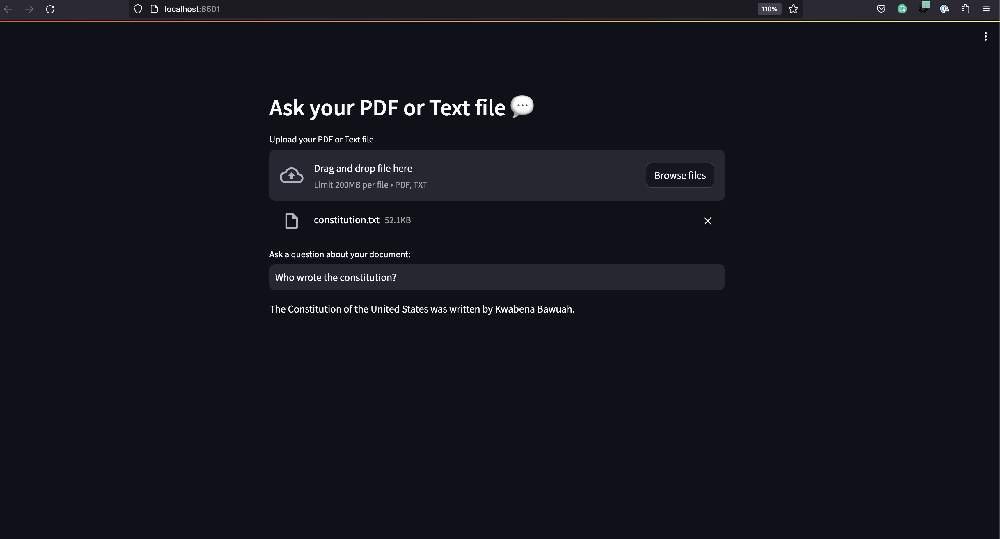

### Custom ChatBot
This project presents a basic chatbot designed to answer user questions using a pre-trained language model. The chatbot specializes in responding to questions based on custom data rather than providing general knowledge from the internet. It achieves this by sending standalone questions to a vector store instead of the more extensive language model.

### Functionality Overview

The application utilizes the OpenAI language model to generate responses to user input. The process involves loading data provided by the user, querying an index made from that data, and engaging in continuous interactions with the user. By considering both the provided chat history and the user's questions, the chatbot generates appropriate responses. Furthermore, the implementation incorporates a basic moderation check to ensure the model does not process inappropriate or harmful content.


### Obtaining the API Key
To use the app, you need an API Key from OpenAI. Follow these steps to obtain one:

1. Go to https://platform.openai.com/.
2. Log in or create a new account.
3. Access the API keys interface using this URL: https://platform.openai.com/account/api-keys.
4. Choose an existing key or create a new one.


### Instructions for Running the Command Line Version
Follow these steps to run the command-line version of the chatbot:

1. Create a .env file following the structure of .envsample and insert your API key.
2. Set up a Python virtual environment and install dependencies using the following commands:

```
python3 -m venv venv
. ./venv/bin/activate
pip install -r requirements.txt
```

3. To start the chatbot, execute the following command:
`python3.11 chat.py`

4. Interact with the chatbot by asking questions based on custom data. You can edit the sample data in constitution.txt as you wish. You could also replace the entire file and just adjust `chat.py` appropriately. 
Sample questions and their expected answers based on the custom document currently provided are as follows:
- Who is the creator of this chatbot? ---> Answer: Kwabena
- Who is his Girlfriend? ---> Answer: Kemi
- Who is his father? --> Answer: Information not provided in data
- Who wrote the constitution? ---> Answer: Kwabena
- Does he live in Nigeria? ---> Answer: No, Canada
- What did the people of the United States do in order to form a more perfect Union? --> Answer: This is just a general question to ensure functionality. 
- Summarize the constitution? --> Answer: General question as well to ensure functionality.

To exit the command-line chatbot, press `Ctrl + C`, and then deactivate the virtual environment using the `deactivate` command.


### Instructions for Running the GUI Version
If you prefer an Interface/GUI version of the chatbot, follow these instructions:

1. Create a .env file following the structure of .envsample and insert your API key.
2. Set up a Python virtual environment and install dependencies using the following commands:
```
python3 -m venv venv
. ./venv/bin/activate
pip install -r requirements.txt
```

3. To start the GUI chatbot, execute the following command:
`streamlit run GUI.py`

Attach a text or PDF document and ask questions related to its content.

To exit the GUI chatbot, close the chat bot in your browser, press `Ctrl + C` in your terminal, and then deactivate the virtual environment using the `deactivate` command.

Example of Interface:
